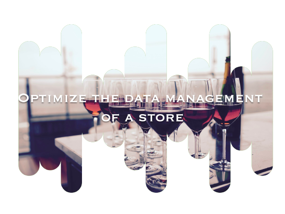

[![Contributors][contributors-shield]][contributors-url]
[![Forks][forks-shield]][forks-url]
[![Stargazers][stars-shield]][stars-url]
[![Issues][issues-shield]][issues-url]
[![MIT License][license-shield]][license-url]
[![LinkedIn][linkedin-shield]][linkedin-url]

<!-- PROJECT LOGO -->
 

  

<h1 align="center">Optimize the data management of a store</h1>

  

    Beginning of a mission as a freelance data analyst at BottleNeck, a very prestigious wine merchant. Our manager on this mission asks us to clean, structure a database and then to make an analysis in order to give him a feedback on the different products during a future meeting.
     
    <a href="https://github.com/CoCasali/optimize-data-management-store"><strong>Explore the docs »</strong></a>
     

  

<!-- TABLE OF CONTENTS -->

  
Table of Contents

  <ol>
    <li>
      <a href="#about-the-project">About The Project</a>
      <ul>
        <li><a href="#built-with">Built With</a></li>
      </ul>
    </li>
    <li><a href="#usage">Usage</a></li>
    <li><a href="#contact">Contact</a></li>
  </ol>

<!-- ABOUT THE PROJECT -->
## About The Project
Our missions will be : 

- [ ] Reconcile the different databases, in order to have a unique database
- [ ] Sales by product + total sales made online
- [ ] Inspecting data entry errors in certain product prices. 

(<a href="#readme-top">back to top</a>)

### Built With

* [![Jupyter][Jupyter.icon]][Jupyter-url]
* [![Python][Python.js]][Python-url]

(<a href="#readme-top">back to top</a>)

<!-- USAGE EXAMPLES -->
## Usage
**Competencies assessed** :

- Perform a univariate analysis to interpret data
- Classify different types of data
- Manage errors and inconsistencies in stored data

(<a href="#readme-top">back to top</a>)

<!-- CONTACT -->
## Contact

Your Name - [@corentincasali](https://twitter.com/corentincasali)

Project Link: [https://github.com/CoCasali/optimize-data-management-store](https://github.com/CoCasali/optimize-data-management-store)

(<a href="#readme-top">back to top</a>)

<!-- MARKDOWN LINKS & IMAGES -->
<!-- https://www.markdownguide.org/basic-syntax/#reference-style-links -->
[contributors-shield]: https://img.shields.io/github/contributors/CoCasali/optimize-data-management-store.svg?style=for-the-badge
[contributors-url]: https://github.com/CoCasali/optimize-data-management-store/graphs/contributors
[forks-shield]: https://img.shields.io/github/forks/CoCasali/optimize-data-management-store.svg?style=for-the-badge
[forks-url]: https://github.com/CoCasali/optimize-data-management-store/network/members
[stars-shield]: https://img.shields.io/github/stars/CoCasali/optimize-data-management-store.svg?style=for-the-badge
[stars-url]: https://github.com/CoCasali/optimize-data-management-store/stargazers
[issues-shield]: https://img.shields.io/github/issues/CoCasali/optimize-data-management-store.svg?style=for-the-badge
[issues-url]: https://github.com/CoCasali/optimize-data-management-store/issues
[license-shield]: https://img.shields.io/github/license/CoCasali/optimize-data-management-store.svg?style=for-the-badge
[license-url]: https://github.com/CoCasali/optimize-data-management-store/blob/master/LICENSE.txt
[linkedin-shield]: https://img.shields.io/badge/-LinkedIn-black.svg?style=for-the-badge&logo=linkedin&colorB=555
[linkedin-url]: https://linkedin.com/in/corentincasali
[Python.js]: https://img.shields.io/badge/Made%20with-Python-yellow?style=for-the-badge&logo=Python&logoColor=yellow
[Python-url]: https://www.python.org/
[Jupyter.icon]:https://img.shields.io/badge/Made%20with-Jupyter-orange?style=for-the-badge&logo=Jupyter
[Jupyter-url]:https://jupyter.org/try
